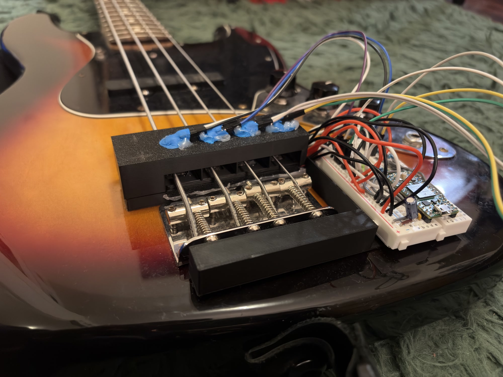

# BassMINT

Bass (M)ount for (I)nfrared (N)ote (T)ranscription is a device built with the Teensy 4.0 that slides onto your bass guitar bridge and streams monophonic tablature in real-time via MIDI. This information can be utilized by software like DAW plugins to create practice, transcription, or education tools. The device currently only supports 4-string bass guitars with the Fender Jazz-style bridge, with up to 24 frets.



## Why?

Bass guitar is tricky because:
- Low frequencies need bigger analysis windows
- Strings vibrate sympathetically and create false triggers
- The same pitch can exist on different strings, so you need to know which string is actually being played

BassMINT uses OPT101 optical sensors (one per string) that are used in a two-phase system:
1. **String detection** - Track each string's envelope to know which one you just plucked
2. **Pitch detection** - The string vibration modulates the light beam, so the same signal tells us the pitch

## Hardware

- **Teensy 4.0** - The brain (600MHz ARM Cortex-M7)
- **4x OPT101 sensors** - One per string for activity and pitch detection
- **4x IR LEDs** - Paired with OPT101s to create the break beam
- **Adafruit MIDI FeatherWing** - Provides hardware MIDI DIN output

## Architecture

### Stage 1: String Activity Detection

OPT101 sensors -> Envelope followers (one per string) -> Active string selection

- Figures out which string you just played based on envelope levels

### Stage 2: Fret Estimation

Active string's OPT101 signal -> High-pass filter (DC removal) -> Low-pass filter (anti-aliasing) -> Decimation (44.1kHz -> 4.4kHz) -> NSDF pitch detection with dual-band analysis -> Bayesian octave tracking -> Frequency + confidence

- Uses the same sensor signal to detect the pitch and map it to a fret
- Splits analysis into low octave (frets 0-11) and high octave (frets 12-24)

### Stage 3: Note Resolution

Active string + Frequency -> Fret lookup (constrained to active string) -> MIDI note

- Combines everything into a final decision: which string, which fret, how confident

### Stage 4: MIDI Output

Note On/Off (channel = string + 1), CC 20 (envelope), CC 21 (state), CC 22 (confidence)

- Each string gets its own MIDI channel for polyphonic tracking

## MIDI Encoding

### Channel-Per-String

Each string gets its own MIDI channel so you can track them independently:

| String | MIDI Channel | Open Note | MIDI Note # |
|--------|--------------|-----------|-------------|
| E (0)  | 1            | E1        | 28          |
| A (1)  | 2            | A1        | 33          |
| D (2)  | 3            | D2        | 38          |
| G (3)  | 4            | G2        | 43          |

The MIDI note number is just the open string note plus the fret number.

### Control Changes

Each channel also sends some extra info via CC messages:

| CC | Name       | Range | Description                              |
|----|------------|-------|------------------------------------------|
| 20 | Envelope   | 0-127 | How loud the string is                   |
| 21 | State      | 0/64  | Is the string active? (0=idle, 64=active)|
| 22 | Confidence | 0-127 | How confident the pitch detector is      |

## Building

### What You Need

- CMake 3.19 or newer
- Ninja build system
- ARM GNU Toolchain (`arm-none-eabi-gcc`)
- Teensy Loader for flashing

### Build

```bash
# Configure (CMakeLists.txt will auto-detect your Teensy cores)
cmake -B build -G Ninja

# Build
cmake --build build

# The output is build/BassMINT.hex
```

If it can't find your Teensy cores automatically, point it there:

```bash
cmake -DTEENSY_PATH="C:/Program Files (x86)/Arduino/hardware/teensy/avr" -B build -G Ninja
```

### Flash

Open Teensy Loader GUI and flash `build/BassMINT.hex`

## Configuration

Main settings in [src/hal/BoardConfig.h](src/hal/BoardConfig.h):

```cpp
static constexpr float SampleRate = 44100.0f;       // Audio sample rate
```

DSP parameters are in their respective headers:

- [OctaveFretEstimator.h](src/dsp/OctaveFretEstimator.h): NSDF confidence threshold (0.6), frequency bands for octave tracking
- [StringActivity.h](src/dsp/StringActivity.h): Attack/release thresholds for string detection (0.1/0.05)
- [EnvelopeFollower.h](src/dsp/EnvelopeFollower.h): Attack/release times (5ms/100ms)

### Debug Output

Enable debugging in [BoardConfig.h](src/hal/BoardConfig.h):

```cpp
static constexpr bool DebugEnabled = true;
static constexpr bool TeleplotMode = false;  // false = text mode, true = graph mode
static constexpr uint32_t DebugOutputHz = 60;  // Update rate for Teleplot
```

**Text mode** (TeleplotMode = false): Prints active string changes to Serial

**Teleplot mode** (TeleplotMode = true): Sends raw ADC values over Serial in Teleplot format:

- `adc_E`, `adc_A`, `adc_D`, `adc_G` - Raw normalized ADC readings (0-1)

Use the [Teleplot VSCode extension](https://marketplace.visualstudio.com/items?itemName=niceprogrammer.teleplot) to visualize.
